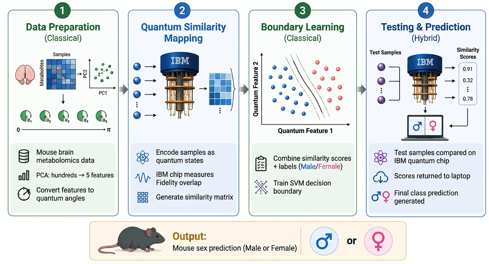

# Quantum Metabolomics Classification 🧬💻

This repository contains the code and results for a project exploring the use of **Quantum Support Vector Machines (QSVM)** for classifying metabolomics data from mouse brain samples to predict Sex (Male vs. Female).

> **Note:** This work does not claim quantum advantage over classical SVMs, but demonstrates the feasibility of hybrid quantum machine learning for metabolomics classification using real quantum hardware.

## 🔄 Workflow



## 📊 Key Results

### 1. The Small-Scale Showdown (100 Samples)
Ran on the real **IBM Quantum** 156-qubit processor (`ibm_fez`):
* **Simulator Accuracy:** 95.00% (Tied with Classical)
* **Real Hardware Accuracy:** **95.00%**

### 2. The Scale & Noise Test (150 Samples)
Ran on the real **IBM Quantum** 127-qubit processor (`ibm_marrakesh`):
* **Simulator Accuracy:** 96.67% (Tied with Classical)
* **Real Hardware Accuracy:** **93.33%** (Reduced due to noise)

---

## 📁 Repository Structure

* `step0_data_preprocessing.py`: Prepares the data (PCA to 5 components and scaling to [0, pi]).
* `step1_data_prep_and_kernel_selection.py`: Tests different feature maps on a simulator.
* `step2_qsvm_100samples_demo.py`: The main demo script that runs the 100-sample test on real hardware.
* `step3_qsvm_150samples_demo.py`: The script for testing scale with 150 samples on hardware/simulator.
* `quantum_metabolomics_report.md`: A detailed report summarizing the experiment, methodology, and results.
* `Workflow.png`: Visual diagram of the hybrid quantum-classical pipeline.
* `data/`: Raw dataset (`feature_matrix.csv`) and prepared quantum-ready `.npz` files.
* `workloads/`: Zipped IBM job result archives from both experiments.
* `scratch/`: Utility scripts for inspecting and reconstructing results from raw IBM job files.

---

## 🛠️ How to Run

### 1. Prerequisites
You need Python 3.10+ and the following libraries:
```bash
pip install qiskit qiskit-ibm-runtime qiskit-machine-learning scikit-learn numpy
```

### 2. IBM Quantum Setup
To run on real hardware, you need a free IBM Quantum account. Get your API token from [IBM Quantum](https://quantum.cloud.ibm.com/).

Open the Python files and replace `"YOUR_IBM_TOKEN"` with your actual token:
```python
QiskitRuntimeService.save_account(channel="ibm_quantum_platform", token="YOUR_IBM_TOKEN", overwrite=True)
```

### 3. Execution
To run the main demo:
```bash
python step2_qsvm_100samples_demo.py
```

---

## ⚙️ Key Technical Contributions

**1. Custom `HardwareSampler` class**
Running QSVM on real IBM hardware required solving two problems that the standard Qiskit library does not handle automatically:
- **Gate incompatibility:** The `ComputeUncompute` fidelity method generates `sxdg` gates unsupported by real backends. The custom sampler intercepts each circuit and transpiles it to the hardware's native gate set before submission.
- **Shot limit:** With 3,160 pair comparisons at IBM's default of 4,096 shots each, the job would exceed IBM's 10M shot limit. The sampler forces `shots=100`, keeping the total at ~316,000.

```python
class HardwareSampler(SamplerV2):
    def run(self, pubs, **kwargs):
        transpiled_pubs = [(transpile(c, self.backend, optimization_level=3), v) for c, v in pubs]
        kwargs.setdefault('shots', 100)
        return super().run(transpiled_pubs, **kwargs)
```

**2. `PauliFeatureMap (Y, Z)` — chosen through simulator benchmarking**
After comparing `ZFeatureMap`, `ZZFeatureMap (linear/circular)`, and `PauliFeatureMap` on a local simulator, `PauliFeatureMap` with `paulis=['Y', 'Z']` consistently achieved the best accuracy. It encodes each feature using two rotation axes (Y and Z) on the Bloch sphere, giving the kernel richer expressibility to separate Male vs Female metabolite profiles in quantum space.

---

## 🎓 About
This project was developed by **Khoa Tran** to demonstrate the feasibility of applying Quantum Machine Learning to metabolomics data from mouse brain samples for Sex classification.

## 📚 Data Source
The features were analyzed from the experimental dataset from the 2021 mouse brain metabolome atlas, available via the Metabolomics Workbench database (study ID: ST001637).
